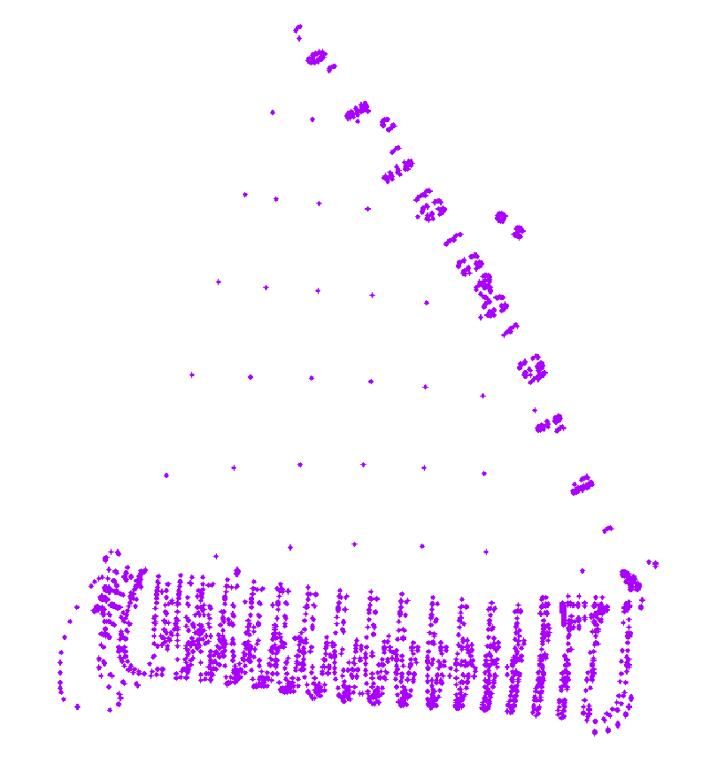
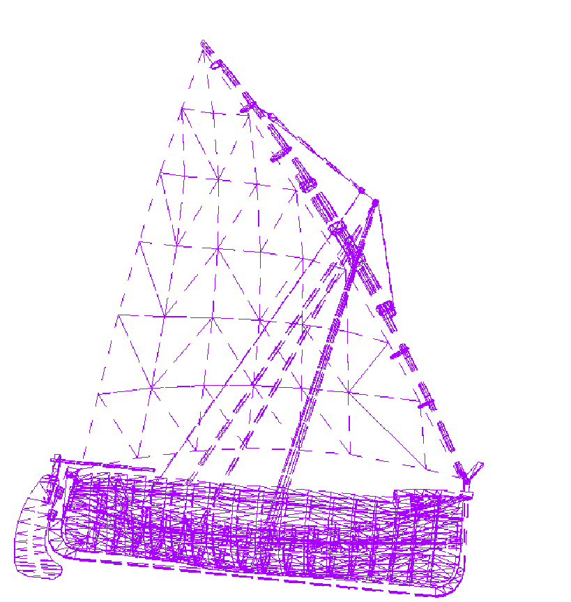
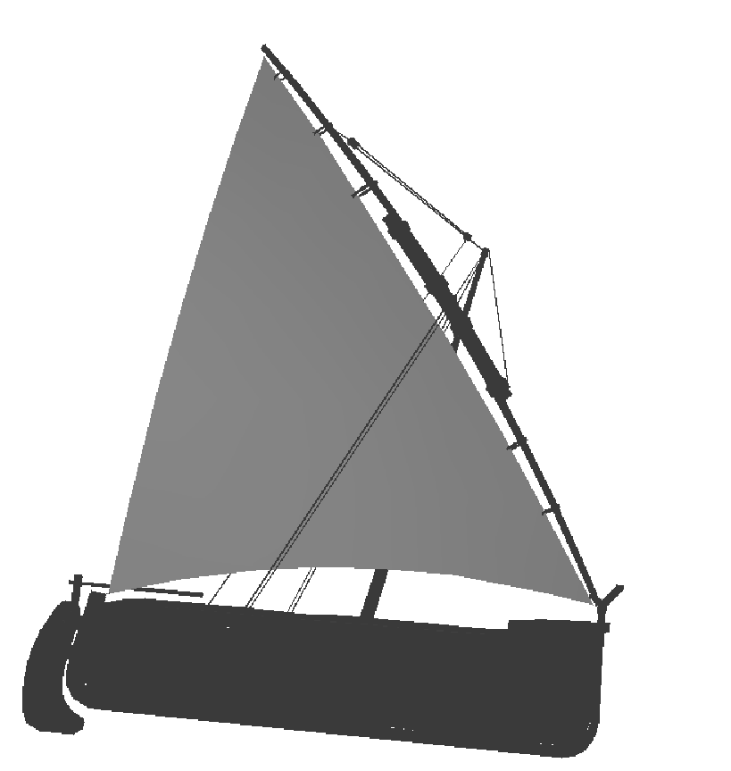
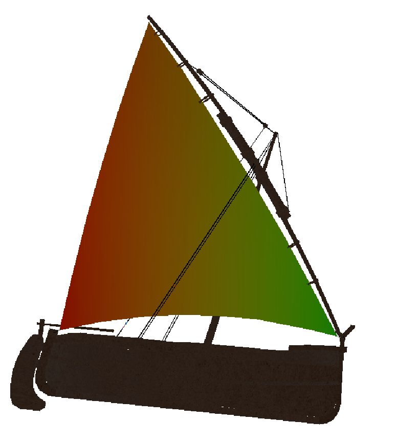
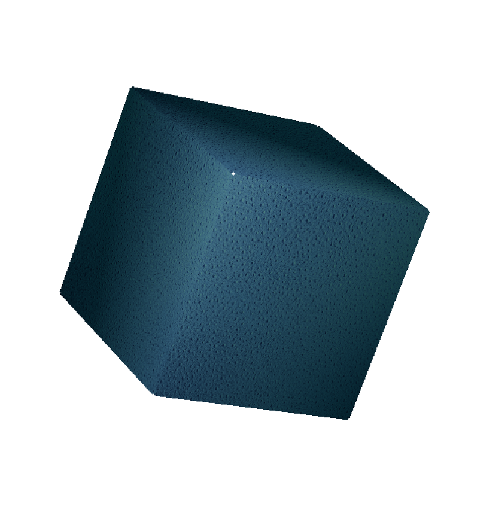
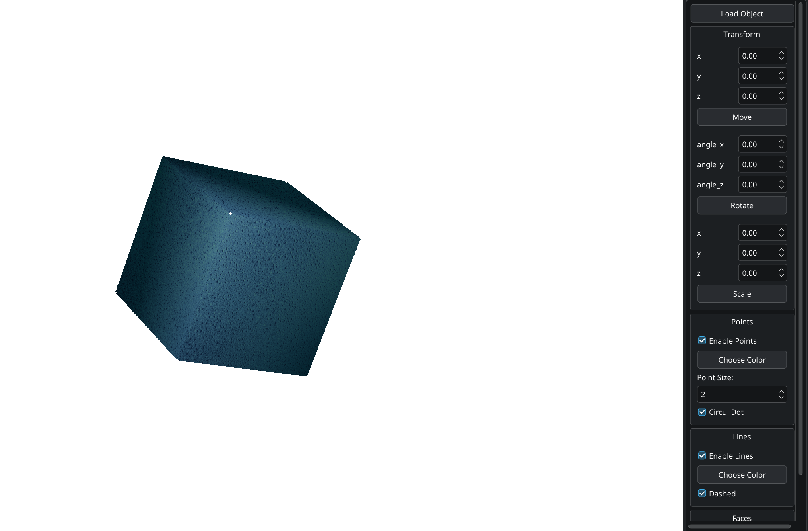

Отличный проект! На основе вашего кода я подготовил структурированный README. Вот предлагаемая структура:

# 3DViewer - Wavefront OBJ File Visualizer

## О проекте
3DViewer - это приложение для визуализации 3D моделей в формате Wavefront OBJ, разработанное на C++ с использованием Qt6. Проект реализует полный программный рендеринг на CPU с ручной реализацией всех алгоритмов.


## Особенности

### 🎯 **Технические особенности**
- **Полностью программный рендеринг** на CPU (без использования GPU)
- **Ручная реализация** всех математических преобразований и алгоритмов
- **Многопоточная обработка** с использованием OpenMP
- **Полный 3D рендеринг пайплайн** от загрузки до отображения

### 📊 **Поддерживаемые режимы отображения**
- **Точки (Vertex)**: квадраты или круги с настраиваемым размером
- **Линии (Wireframe)**: сплошные или пунктирные (dashed)
- **Закрашенные полигоны**: плоское закрашивание (flat shading) с освещением
- **Текстуры**: поддержка UV-маппинга из MTL материалов

### 🔧 **Функциональность**
- **Афинные преобразования**: перемещение, поворот, масштабирование
- **Освещение**: модель Фонга (ambient, diffuse компоненты)
- **Backface Culling**: отсечение невидимых граней
- **Z-буферизация**: корректное отображение глубины
- **Материалы**: поддержка MTL файлов с текстурами

## Демонстрация

### 📊 **Режимы отображения**

| Режим точек | Режим линий | Закрашенные полигоны |
|-------------|-------------|---------------------|
|  |  |  |

### 🎨 **Особенности рендеринга**

| Текстуры | Освещение |
|----------|-----------|
|  | 

### 🔧 **Интерфейс приложения**



*Главное окно приложения с загруженной моделью*

## Примеры моделей

```obj
# cube.obj
v 0.0 0.0 0.0
v 1.0 0.0 0.0
v 1.0 1.0 0.0
v 0.0 1.0 0.0
f 1 2 3 4
```

## Архитектура рендеринга

### 🚀 **Пайплайн рендеринга**:

```cpp
1. TransformToWorldCoordinates()    // Локальные → мировые координаты
2. BackfaceCullingParallel()        // Отсечение невидимых граней  
3. TransformToCameraCoordinates()   // Мировые → координаты камеры
4. ProjectToCamera()               // Проекция (перспективная/ортографическая)
5. ClipedObject()                  // Отсечение по объему видимости
6. ProjectToScreen()               // Координаты камеры → экранные координаты
7. RasterizeMesh()                 // Растеризация треугольников
```

### 🎨 **Алгоритмы визуализации**

#### **Растеризация треугольников**
- **Базисные координаты** для интерполяции атрибутов
- **Scanline алгоритм** с ограничивающим прямоугольником
- **Интерполяция глубины**, нормалей и текстурных координат

#### **Освещение и материалы**
```cpp
Color calculatePhongIlluminationForVertex():
- Ambient:  material.ambient * light.color
- Diffuse:  material.diffuse * light.color * max(dot(n, lightDir), 0)
```

#### **Текстурный маппинг**
- **Perspective-correct interpolation** текстурных координат
- **Поддержка UV-координат** из OBJ файлов

## Техническая реализация


### 🔄 **Ключевые классы**

#### **RenderRasterize** - ядро рендеринга
- `rendering()` - основной цикл рендеринга
- `rasterizeMesh()` - растеризация закрашенных полигонов
- `drawTriangle()` - отрисовка одного треугольника с освещением
- `calculatePhongIlluminationForVertex()` - расчет освещения

#### **Оптимизации**
```cpp
// Многопоточность с OpenMP
#pragma omp parallel for
for (int i = 0; i < vertices.size(); i++) {
    // Параллельная обработка
}

// Backface culling
if (faceNormal.dot(viewDir) < -0.001) {
    // Грань видима
}
```

## Форматы файлов

### 📐 **Wavefront OBJ поддержка**
```obj
v  x y z         # Вершины (Vertex)
vt u v           # Текстурные координаты  
vn i j k         # Нормали (Normal)
f v1/vt1/vn1 ... # Грани (Face)
```

### 🎨 **MTL материалы**
- Ambient, Diffuse цвета
- Текстуры диффузного отображения
- Поддержка освещения

## Сборка и запуск

### Требования
- C++17 компилятор
- Qt6 Core, Gui модули

### Сборка
```bash
qmake6 -config release
make
./main
```

## Управление

### 🎮 **Навигация**
- **Перемещение**: WASD или стрелки или в панели
- **Вращение**: QE, XC, RF или в панели
- **Масштаб**: в панели 

### ⚙️ **Настройки рендеринга**
- Переключение между точками/линиями/полигонами
- Включение/выключение текстур
- Настройка параметров освещения
- Изменение размеров точек и типа линий

## Примеры использования

```cpp
// Создание сцены и рендерера
Scene scene;
RenderRasterize renderer(settings, width, height);

// Загрузка OBJ файла
scene.loadObject("model.obj");

// Рендеринг кадра
renderer.rendering(scene);
```

## Производительность

### 🚀 **Оптимизации**
- **Многопоточность**: параллельная обработка вершин и граней
- **Early Z-test**: предварительный тест глубины
- **Backface culling**: уменьшение количества обрабатываемых граней
- **Bounding box**: ограничивающие прямоугольники для треугольников

